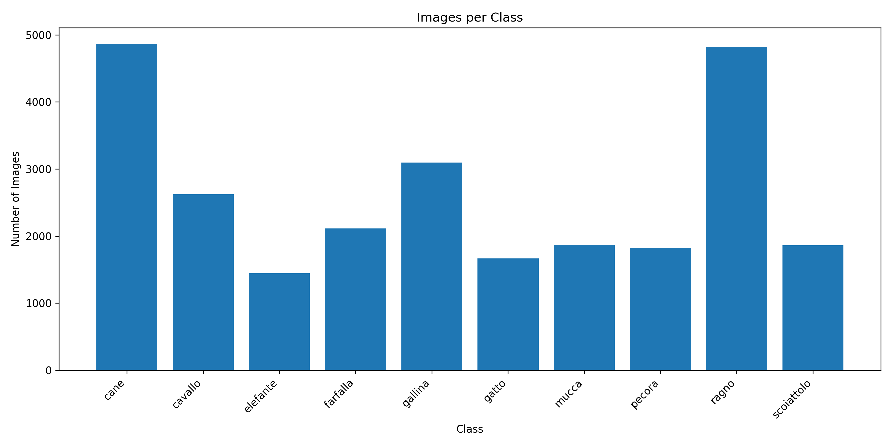
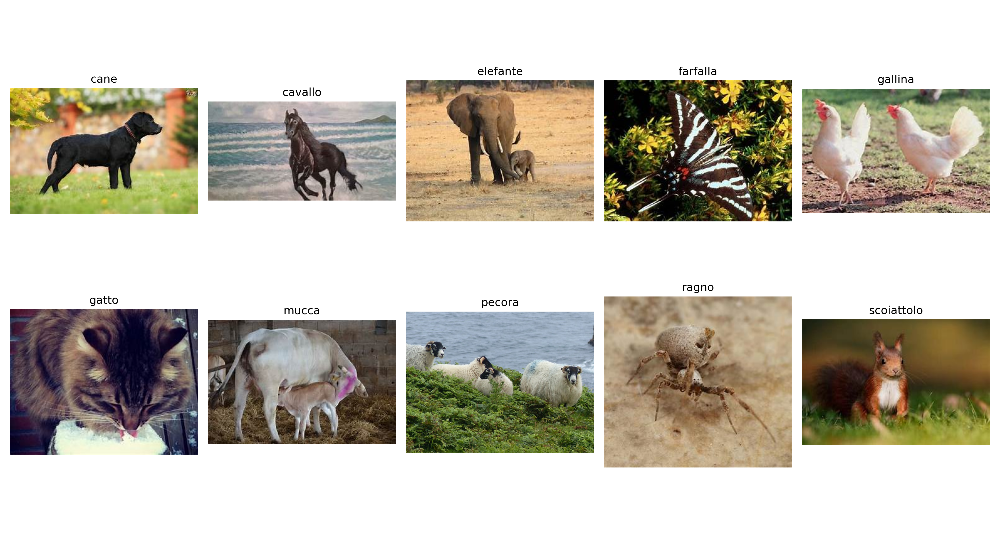
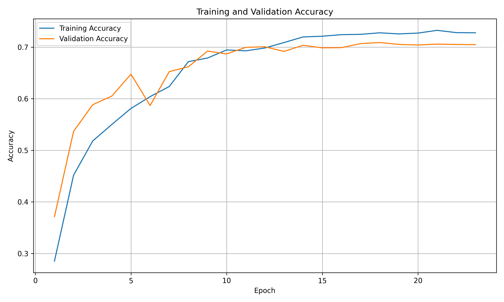
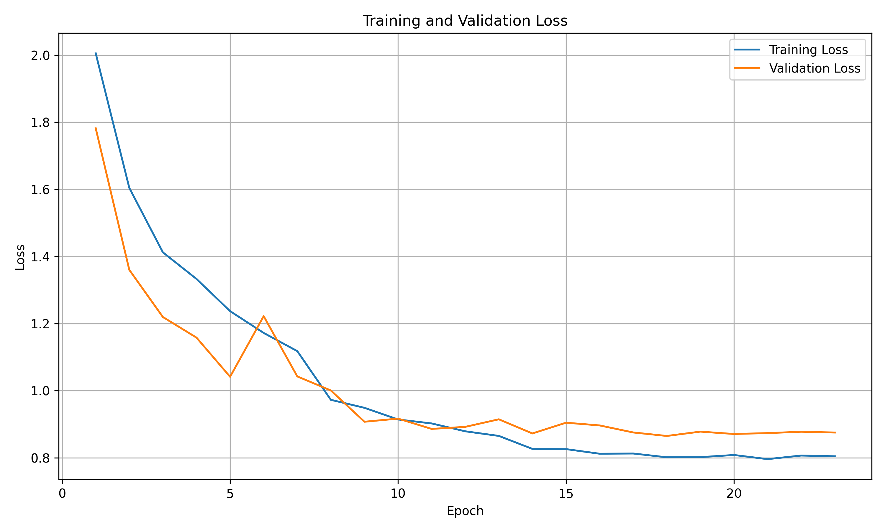
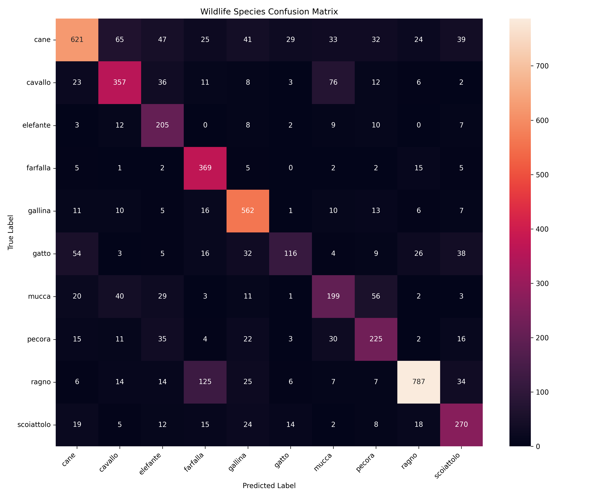
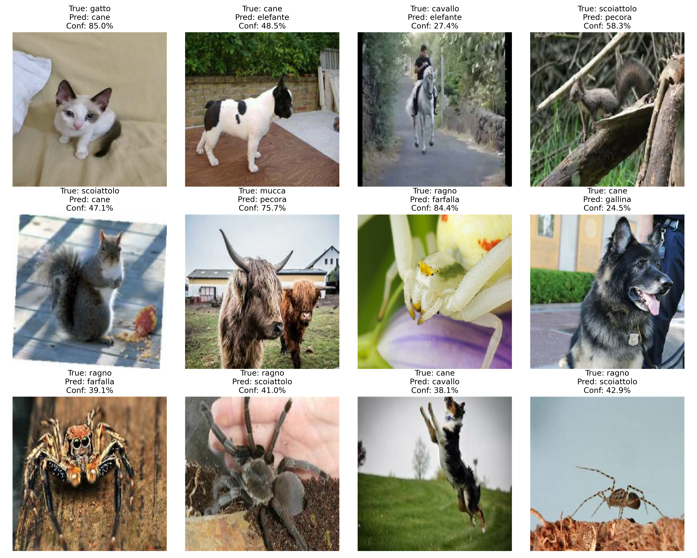

# Wildlife Species Image Classifier

A deep learning project that classifies wildlife/animal images into 10 species using a Convolutional Neural Network (CNN) built with TensorFlow and Keras. The pipeline covers dataset exploration, preprocessing, data augmentation, model training, evaluation, and an interactive Colab demo for classifying your own images.

## Overview

This project trains a CNN from scratch on the [Animals-10](https://www.kaggle.com/datasets/alessiocorrado99/animals10) dataset from Kaggle to recognize 10 animal classes:

| Class (Italian) | Species |
|---|---|
| cane | Dog |
| cavallo | Horse |
| elefante | Elephant |
| farfalla | Butterfly |
| gallina | Chicken |
| gatto | Cat |
| mucca | Cow |
| pecora | Sheep |
| ragno | Spider |
| scoiattolo | Squirrel |

## Features

- Automatic dataset download via `kagglehub`
- Exploratory data analysis (class distribution plot, sample image grid)
- `tf.keras.utils.image_dataset_from_directory` pipeline with an 80/20 train/validation split
- On-the-fly data augmentation (random flip, rotation, zoom, contrast)
- A custom 4-block Conv2D CNN with dropout regularization
- Training callbacks: `EarlyStopping`, `ReduceLROnPlateau`, and `ModelCheckpoint`
- Full evaluation suite: accuracy/loss curves, classification report, confusion matrix, and a gallery of misclassified images
- Ready-to-use inference function plus an interactive Colab image-upload demo
- Saved `.keras` model artifacts for reuse

## Model Architecture

A sequential CNN operating on `180x180x3` images:

```
Input (180, 180, 3)
 → Data Augmentation (flip, rotation, zoom, contrast)
 → Rescaling (1/255)
 → Conv2D(32)  → MaxPooling2D
 → Conv2D(64)  → MaxPooling2D
 → Conv2D(128) → MaxPooling2D
 → Conv2D(256) → MaxPooling2D
 → Dropout(0.25)
 → Flatten
 → Dense(256, relu) → Dropout(0.50)
 → Dense(10, softmax)
```

- **Optimizer:** Adam (`lr=0.001`)
- **Loss:** Sparse categorical crossentropy
- **Batch size:** 32
- **Max epochs:** 30 (with early stopping on validation loss)
- **Seed:** 42 (for reproducibility)

## Repository Structure

```
.
├── Wildlife_Species_Classification.ipynb   # Main notebook: data, training, evaluation, inference
├── requirements.txt                        # Python dependencies
└── results/                                # Saved plots, metrics, and trained model artifacts
    ├── wildlife_cnn.keras
    ├── wildlife_cnn_best.keras
    ├── accuracy_graph.png
    ├── loss_graph.png
    ├── confusion_matrix.png
    ├── misclassified_images.png
    ├── class_distribution.png
    └── sample_images.png
```

## Getting Started

### Prerequisites

- Python 3.x
- A Kaggle account (for `kagglehub` dataset access) — no manual download needed, the notebook handles it
- GPU recommended (the notebook was developed on Google Colab with a T4 GPU) but not required

### Installation

```bash
git clone https://github.com/arijitgupta02/wildlife-species-image-classifier.git
cd wildlife-species-image-classifier
pip install -r requirements.txt
```

Or, from inside the notebook itself:

```bash
pip install -q kagglehub tensorflow scikit-learn seaborn pillow matplotlib
```

### Usage

1. Open `Wildlife_Species_Classification.ipynb` in Jupyter or Google Colab.
2. Run the cells in order:
   - The dataset is downloaded automatically via `kagglehub.dataset_download("alessiocorrado99/animals10")`.
   - The notebook auto-detects the correct image class directory inside the downloaded dataset.
   - Training runs for up to 30 epochs with early stopping and learning-rate reduction.
3. Review the generated plots and the printed classification report (see Results below).
4. Use the built-in `predict_image()` function, or the interactive Colab file-upload cell, to classify your own images:

```python
predicted_class, confidence = predict_image("your_image.jpg")
print(predicted_class, confidence)
```

## Dataset

- **Name:** Animals-10
- **Source:** [Kaggle — alessiocorrado99/animals10](https://www.kaggle.com/datasets/alessiocorrado99/animals10)
- **Classes:** 10 animal species, class-imbalanced (see class distribution below)
- **Access:** Downloaded automatically at runtime via `kagglehub`

### Class Distribution



### Sample Images



## Results

The model reaches roughly **71% validation accuracy** after training, with early stopping kicking in once validation loss plateaus around epoch 20.

### Training Curves

| Accuracy | Loss |
|---|---|
|  |  |

### Confusion Matrix



The model performs strongly on visually distinct classes like `cane` (dog), `ragno` (spider), `gallina` (chicken), and `farfalla` (butterfly), while classes such as `gatto` (cat) and `mucca` (cow) see more confusion — notably `gatto` is frequently misclassified as `cane`, and `mucca` is often confused with `pecora` (sheep) and `cavallo` (horse).

### Misclassified Examples



Most errors occur between visually or contextually similar classes (e.g. `scoiattolo`/squirrel vs `cane`/dog in cluttered backgrounds, or `ragno`/spider vs `farfalla`/butterfly on flowers), and tend to have lower prediction confidence, suggesting the model is appropriately uncertain on ambiguous images.

## Tech Stack

- TensorFlow / Keras
- scikit-learn (metrics)
- seaborn / matplotlib (visualization)
- Pillow (image handling)
- kagglehub (dataset access)

## License

No license specified. Check the [repository](https://github.com/arijitgupta02/wildlife-species-image-classifier) for updates.

## Acknowledgments

- Dataset by [Corrado Alessio](https://www.kaggle.com/alessiocorrado99) on Kaggle
- Built with TensorFlow/Keras
